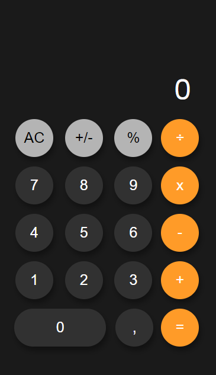

# Clone da calculadora do iPhone

Clone da calculadora do iPhone

## Tabela de conteúdos

- [Visão Geral](#visão-geral)
  - [Funcionalidades](#funcionalidades)
  - [Screenshot](#screenshot)
  - [Links](#links)
- [Meu processo](#meu-processo)
  - [Feito com](#feito-com)
- [Autor](#autor)

## Visão Geral

### Funcionalidades

O usuário deve ser capaz de:

- ver animações de hover nos elementos interativos da página
- Somar, subtrair, dividir e multiplicar números
- Ver o resultado das operações
- Fazer os números ficarem negativos ou positivos
- Resetar as operações

### Screenshot

### Links

- Live Site URL: [Calculadora iPhone](https://simonfranklin1.github.io/calculadora-iphone/)

## Meu processo

### Feito com

- HTML5 Semântico
- CSS 
- Flexbox
- Feito em Mobile-First
- Javascript(ES6)

### Autor
- Simon Franklin: [Simon Franklin](https://github.com/simonfranklin1)
